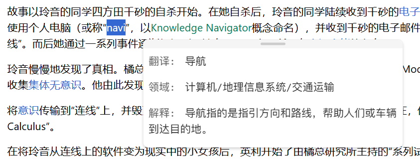

# NAVI - 智能划词助手

NAVI是一个强大的浏览器划词翻译插件，支持多AI平台和本地模型，提供智能翻译和解释功能。



## 主要特性

- 支持多AI平台API（OpenAI, 第三方接口平台等）
- 支持本地Ollama模型部署
- 专业术语翻译+注释
- 跨浏览器支持（Chrome/Edge）
- 智能缓存系统，提高响应速度
- 自动语言检测和领域识别(可开关)
- 流式响应显示，实时查看结果
- 支持自定义API端点
- 主选语言处理控制，灵活管理不同语言内容
- **思考模式控制**：可针对Qwen3系列模型开启/关闭思考模式

## 安装说明

1. 克隆仓库：

```bash
git clone https://github.com/UFOAlastor/NAVI.git
cd navi
```

2. 安装依赖：

```bash
npm install
```

3. 构建项目：

```bash
npm run build
```

4. 在Chrome/Edge中加载插件：
   - 打开浏览器扩展管理页面
   - 启用开发者模式
   - 点击"加载已解压的扩展程序"
   - 选择项目中的 `dist`目录

## 配置说明

1. 点击浏览器工具栏中的NAVI图标
2. 在设置页面中：
   - 选择默认AI服务（OpenAI兼容类/Ollama）
   - 配置API密钥或服务地址
   - 设置Ollama服务器地址和模型
   - 自定义响应格式和显示选项
   - 配置主选语言处理方式
   - 使用Qwen3模型时，可配置思考模式开关

## 使用方法

1. 在网页上选中任意文本
2. NAVI会自动检测文本类型并执行翻译+术语注释
3. 系统会使用智能缓存提高响应速度
4. 支持流式响应，结果将实时显示

## 高级功能

- **多模型切换**：可在OpenAI各模型和Ollama本地模型间快速切换
- **并发控制**：内置限流器确保API稳定性
- **智能重试**：网络问题自动重试，指数退避策略
- **结果后处理**：自动格式化和清理结果文本
- **主选语言处理控制**：针对包含主选语言的文本提供三种处理选项：
  - 自动翻译解释（默认）：检测到包含主选语言时自动处理
  - 显示触发按钮：需要手动点击按钮才会处理
  - 关闭：包含主选语言的文本将不被处理
- **思考模式控制**：针对Qwen3系列模型提供思考模式开关：
  - 当启用时：模型会展示思考过程，类似ChatGPT网页版的推理过程
  - 当关闭时：使用/no_think指令，模型将直接输出结果，响应速度更快
  - 此功能仅在使用包含"qwen3"的模型时可用（如Qwen/Qwen3-30B-A3B）

## 开发说明

- 开发模式：`npm run dev`
- 生产构建：`npm run build`

## 技术栈

- JavaScript (ES6+)
- Chrome Extension Manifest V3
- Webpack
- OpenAI API
- Ollama

## 许可证

MIT License

## Ollama 服务配置说明

### 跨域访问配置

NAVI 扩展需要访问本地运行的 Ollama 服务，这涉及到浏览器的跨域访问问题。由于浏览器的同源策略（Same-Origin Policy）限制，需要正确配置 Ollama 服务的 CORS（跨域资源共享）策略。

#### 为什么需要设置 OLLAMA_ORIGINS=*？

- 浏览器插件运行在独立的源（如 chrome-extension://）
- 本地 Ollama 服务默认运行在 http://localhost:11434
- 浏览器会因同源策略阻止跨域请求
- 设置 OLLAMA_ORIGINS=* 允许所有来源的请求访问 Ollama 服务

#### 如何正确启动 Ollama 服务？

Windows CMD:

```cmd
set OLLAMA_ORIGINS=* && ollama serve
```

Windows PowerShell:

```powershell
$env:OLLAMA_ORIGINS="*"; ollama serve
```

Linux/macOS:

```bash
OLLAMA_ORIGINS="*" ollama serve
```

> **安全提示**：设置 `OLLAMA_ORIGINS="*"` 将允许任何来源访问您的 Ollama 服务。这在本地开发环境中是安全的，但如果您的计算机连接到公共网络，建议使用更严格的设置。

## 更新日志

- 1.1.8（2025-08-14）
  - 修复：在部分站点存在自带划词/引用浮层时，本扩展的小图标/弹窗可能不显示或被误关的问题。
  - 加固：采用捕获阶段监听、忽略合成点击、短暂宽限+邻近判定、防移除守护（MutationObserver）、顶层 z-index 与强制定位/交互样式。
  - 设计：不改变现有产品逻辑，仅增强抗干扰。
  - 构建：生产构建通过。
